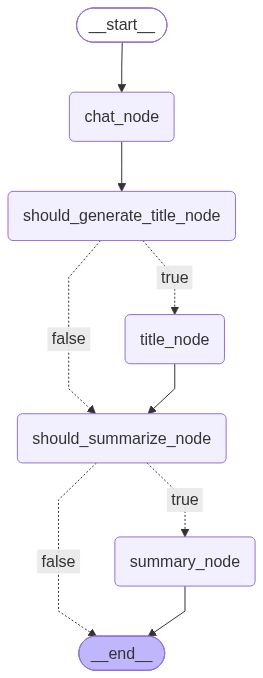

# AI Personal ChatBot

A **ChatGPT-like AI Personal Assistant** built from scratch as a long-term learning project.

The goal is to understand how modern AI assistants are designed and engineered, rather than simply building a chatbot using existing frameworks.

The project is developed incrementally, with each phase introducing new architectural concepts.

---

# Learning Objectives

- Software Architecture
- AI System Design
- Conversation Management
- Database Design
- Memory Management
- Context Engineering
- Retrieval-Augmented Generation (RAG)
- Long-Term Memory
- Agentic Workflows
- Graph-based AI orchestration
- API and application architecture
- Containerization and deployment
- Scalable AI Application Design

The main focus is understanding **why** a design is required before implementing **how** it works.

---

# End Goal

Build a personal AI assistant capable of:

- Managing multiple conversations
- Persisting conversations across application restarts
- Remembering information across sessions
- Maintaining long-term memory
- Retrieving relevant context
- Answering questions from documents
- Supporting agentic workflows
- Using tools and specialized agents
- Following production-oriented engineering practices

---

# Current Features

## Phase 1 — Foundation

- Streamlit chat interface
- Ollama local LLM
- Streaming responses
- Multiple chat sessions
- Session isolation
- In-memory conversation management

## Phase 2 — Persistent Conversation Memory

- SQLite database
- Persistent chat sessions
- Persistent conversation history
- Repository pattern
- Database initialization
- Conversation title generation
- Layered architecture

Architecture introduced:

```text
UI
 ↓
Service
 ↓
Memory
 ↓
Repository
 ↓
Database
```

## Phase 3 — Conversation Summary

- Rolling conversation summarization
- Persistent summaries
- Summary versioning
- Summary coverage tracking
- Configurable summarization thresholds
- Summary Agent
- Summary Memory
- Previous summary + new conversation summarization
- Context compression
- Delete chat functionality
- Improved chat generation UX

## Phase 4 — Agentic Framework

Introduced **LangGraph** as the orchestration layer.

Implemented:

- Graph state
- Nodes
- Edges
- Conditional edges
- Conditional routing
- Title generation workflow
- Summary workflow
- Title generation decision
- Summary decision
- Graph visualization
- LangGraph streaming
- FastAPI integration
- Streamlit integration
- Docker and Docker Compose

Current workflow:

```text
START
  │
  ▼
chat_node
  │
  ▼
should_generate_title_node
  │
  ├── true ──> title_node ───────┐
  │                              │
  └── false ─────────────────────┤
                                 ▼
                        should_summarize_node
                           │             │
                         true          false
                           │             │
                           ▼             ▼
                      summary_node      END
                           │
                           ▼
                          END
```

LangGraph is responsible for **orchestration**, while application services, agents, memory, and repositories remain responsible for their respective logic.

---

# Architecture

The current application consists of a Streamlit UI, FastAPI backend, LangGraph orchestration layer, application services, memory components, database repositories, SQLite, and Ollama.

```text
                         User
                           │
                           ▼
                    ┌─────────────┐
                    │  Streamlit  │
                    │     UI      │
                    └──────┬──────┘
                           │
                           │ HTTP
                           ▼
                    ┌─────────────┐
                    │   FastAPI   │
                    │   Backend   │
                    └──────┬──────┘
                           │
                           ▼
                    ┌─────────────┐
                    │  LangGraph  │
                    │ Orchestrator│
                    └──────┬──────┘
                           │
              ┌────────────┼────────────┐
              │            │            │
              ▼            ▼            ▼
        ChatService   TitleAgent   SummaryMemory
              │            │            │
              │            │       SummaryAgent
              │            │
              └────────────┼────────────┘
                           │
                           ▼
                    ┌─────────────┐
                    │   Memory    │
                    │    Layer    │
                    └──────┬──────┘
                           │
                           ▼
                    ┌─────────────┐
                    │ Repository  │
                    │    Layer    │
                    └──────┬──────┘
                           │
                           ▼
                    ┌─────────────┐
                    │   SQLite    │
                    └─────────────┘

                    ┌─────────────┐
                    │   Ollama    │
                    │  Local LLM  │
                    └─────────────┘
```

# LangGraph Orchestrator flow


---

# Technology Stack

| Category | Technology |
|---|---|
| Language | Python |
| UI | Streamlit |
| API | FastAPI |
| Database | SQLite |
| LLM Runtime | Ollama |
| Agent Framework | LangGraph |
| Package Manager | uv |
| Containerization | Docker |
| Container Orchestration | Docker Compose |

---

# Repository Structure

```text
AI-Personal-ChatBot/

├── src/
│   ├── app/
│   │   ├── agents/
│   │   ├── api/
│   │   ├── core/
│   │   ├── database/
│   │   ├── graph/
│   │   ├── llm/
│   │   ├── memory/
│   │   ├── models/
│   │   ├── prompts/
│   │   └── utils/
│   │
│   ├── ui/
│   │   └── streamlit_app.py
│   │
│   └── config.py
│
├── ipynb/
├── docker/
├── chatbot_graph.png
├── pyproject.toml
├── uv.lock
└── README.md
```

---

# Configuration

API URLs used by the Streamlit UI are configured in:

```text
src/config.py
```

The configuration supports both local development and Docker Compose.

## Local Development

When running Streamlit and FastAPI directly on the local machine, use:

```python
chat_url: str = "http://127.0.0.1:8000/api/chat"
session_url: str = "http://127.0.0.1:8000/api/sessions"
```

## Docker

When running the application using Docker Compose, use the backend service name:

```python
chat_url: str = "http://backend:8000/api/chat"
session_url: str = "http://backend:8000/api/sessions"
```

These settings can be switched in:

```text
src/config.py
```

by uncommenting the configuration for the environment being used and commenting out the other configuration.

---

# Prerequisites

- Python 3.12 or later
- uv
- Docker
- Docker Compose
- Ollama

A supported Ollama model must be available when running the application.

---

# Installation

Clone the repository:

```bash
git clone <repository-url>
cd AI-Personal-ChatBot
```

Install dependencies:

```bash
uv sync
```

---

# Running the Application

## Local Development

Make sure Ollama is running and the configured model is available.

Start FastAPI:

```bash
uvicorn src.app.api.main:fapp
```

Start Streamlit:

```bash
uv run python -m streamlit run src/ui/streamlit_app.py
```

Open the Streamlit URL shown in the terminal.

---

## Docker

The application can also be run using Docker Compose.

```bash
docker compose up
```

The main application flow is:

```text
Streamlit
    │
    ▼
FastAPI
    │
    ▼
LangGraph
    │
    ▼
Ollama
```

When running inside Docker, services communicate using Docker Compose service names rather than `127.0.0.1` or `localhost`.

---

# Project Status

## Current Version

**v0.4.0**

### Completed

- Phase 1 — Foundation
- Phase 2 — Persistent Conversation Memory
- Phase 3 — Conversation Summary
- Phase 4 — Agentic Framework

---

# Upcoming Phases

Future development will introduce additional AI system capabilities, including:

- Observability
- RAG
- Context building
- Semantic memory
- Episodic memory
- Long-term memory retrieval
- Tool calling
- Advanced agentic workflows
- Evaluation
- Production-oriented improvements

---

# Development Philosophy

- Learn by building
- Understand **why** before **how**
- Simplicity before complexity
- Incremental development
- Clear separation of concerns
- Modular architecture
- Avoid unnecessary abstraction
- Design for future scalability
- Complete one phase before moving to the next

The project is primarily a **learning and engineering exercise** focused on understanding how AI assistant systems are designed from the ground up.

---

# Contributing

This is currently a personal learning project.

Contributions are not planned at this stage.

---

# License

License information will be added in a future release.
